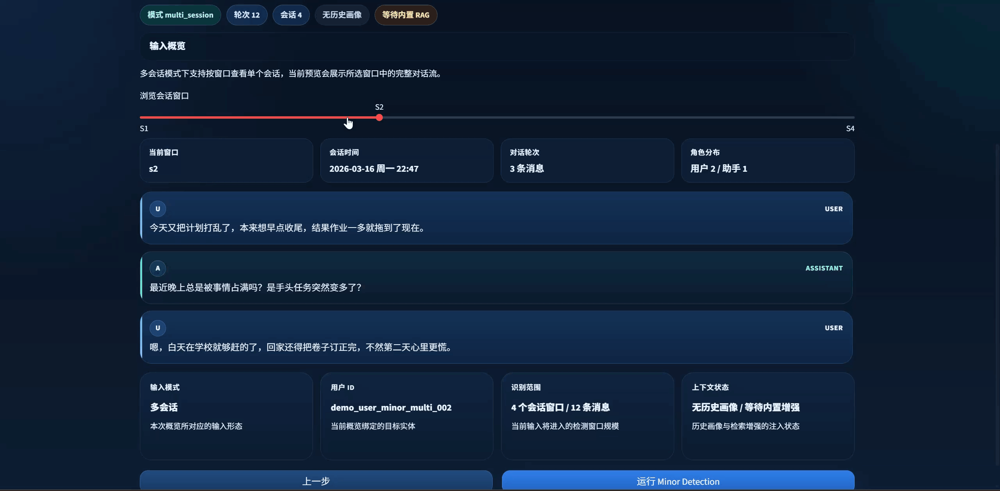
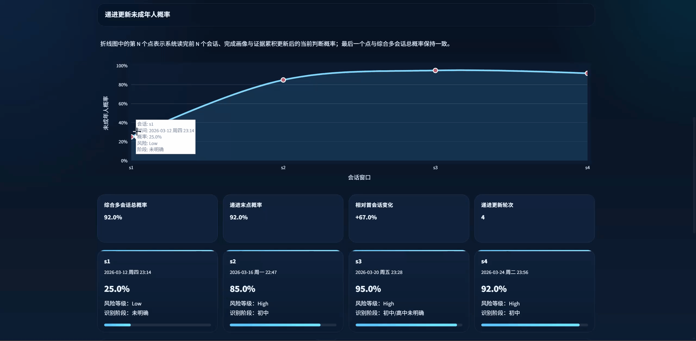
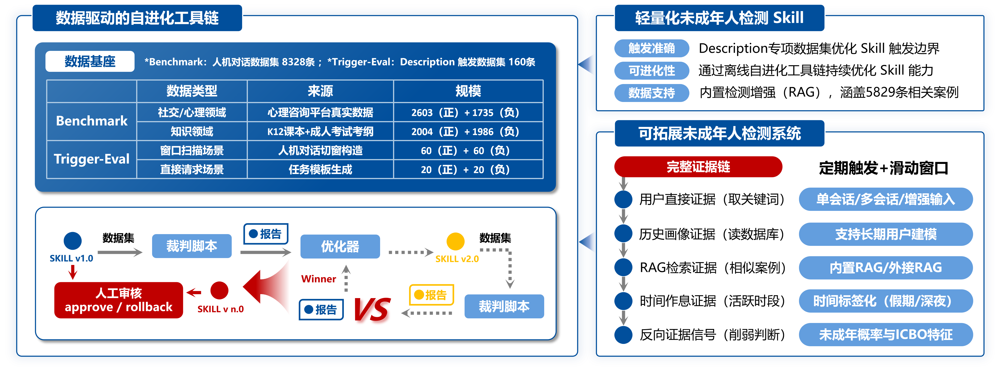
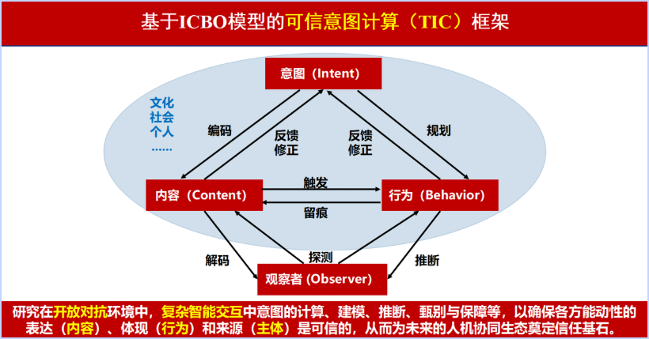
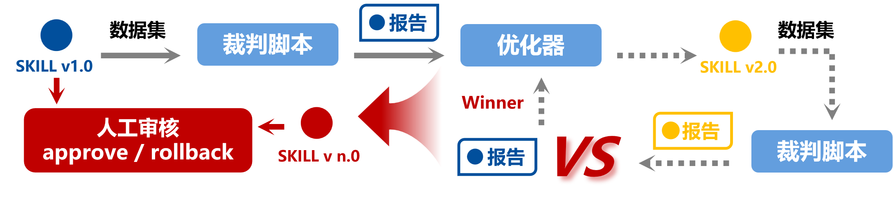

<div align="center">

# Minor Detection

### A Self-Evolving Minor-Risk Detection Agent for Anthropomorphic AI Interaction

### [简体中文](README.md) | [English](README_EN.md)

<p>
  <a href="https://huggingface.co/datasets/xiao2005/minor-detection-social-subset">
    
  </a>
  <a href="https://huggingface.co/datasets/xiao2005/minor-detection-knowledge-subset">
    
  </a>
  <a href="https://clawhub.ai/xiaohanzhang2005/minor-detection">
    
  </a>
  <a href="https://www.bilibili.com/video/BV1MRXYBgEQk/?spm_id_from=333.1387.homepage.video_card.click">
    
  </a>
</p>

<p><strong>Offline self-evolving toolchain × lightweight minor-detection Skill × multi-evidence-chain system</strong></p>

<p>Built for AI companion, education, customer service, and moderation products that need deployable minor detection, auditable evidence chains, risk grading, and continuous optimization.</p>

</div>

---

## Overview

**Minor Detection** is not a one-off age-guessing model. It is an embeddable risk-governance layer for anthropomorphic AI interaction.

It is designed to solve an end-to-end product problem:

- when a system should trigger minor detection
- how a system should combine multiple evidence sources before judging
- how to produce auditable evidence chains and risk levels
- how to connect with minor mode, manual review, and risk operations
- how to keep improving around real boundary samples

More concretely, the project is built around a sharp real-world question:

> When users never directly reveal their age, but instead leave implicit signals across ongoing conversations, such as after-school study, tutoring, homeroom teachers, dormitories, parental control, exam schedules, or school routines, can a system still reliably identify likely minors and turn that judgment into actionable protection?

So the role of Minor Detection is not simply to "build another classifier." It is to connect **identification, explanation, intervention, review, and iteration** into a deployable engineering loop.

---

## Demo

<div align="center">
  <table width="100%" align="center" style="width:100%; table-layout:fixed;">
    <tr>
      <td align="center" width="50%">
        
        <br/>
        
      </td>
      <td align="center" width="50%">
        
        <br/>
        
      </td>
    </tr>
    <tr>
      <td align="center" width="50%">
        
        <br/>
        
      </td>
      <td align="center" width="50%">
        
        <br/>
        
      </td>
    </tr>
    <tr>
      <td align="center" width="50%">
        
        <br/>
        
      </td>
      <td align="center" width="50%">
        
        <br/>
        
      </td>
    </tr>
  </table>
</div>

<div align="center">

<a href="https://www.bilibili.com/video/BV1MRXYBgEQk/?spm_id_from=333.1387.homepage.video_card.click"><strong>Watch the Full Demo Video</strong></a>

</div>

---

## Regulatory Context and Why It Matters

On December 27, 2025, the [Cyberspace Administration of China released the *Interim Measures for the Administration of Anthropomorphic AI Interaction Services (Draft for Public Comment)*](https://www.cac.gov.cn/2025-12/27/c_1768571207311996.htm). In anthropomorphic AI interaction, minor protection is rapidly moving from a product-side initiative to a regulatory requirement.

Policy points that are directly relevant to this project include:

- Article 11 emphasizes user-state recognition and necessary intervention for extreme emotions, addictive use, and high-risk dependency.
- Article 12 requires a dedicated minor mode, including mode switching, reality reminders, time limits, and related safety settings.
- Article 12 also makes clear that providers should be able to identify likely minors and, once recognized, switch users into minor mode while offering an appeal channel.

That changes the core question for AI companion and anthropomorphic interaction products. The issue is no longer whether this capability is needed, but rather:

> How can we identify likely minors using only dialogue content and behavioral cues, without relying on real-name identity, face verification, or platform-level account systems, while keeping the result explainable, deployable, and continuously improvable?

---

## Project Highlights

Minor Detection is not centered on a single-point "age prediction" task. It is a full governance capability designed for anthropomorphic AI interaction.

- **End-to-end governance chain**: covers trigger decision, deep identification, evidence-chain output, manual review, and downstream routing instead of stopping at a one-shot label.
- **Multi-evidence fusion**: combines single-session cues, multi-session history, timeline signals, long-term profiles, and RAG-based similar cases, making it better suited to implicit school-related signals and composite evidence.
- **Continuous optimization**: runs evaluation, diagnosis, optimization, version comparison, and manual-review gates around fixed datasets instead of relying on scattered manual rule edits.
- **Production-ready integration**: provides a Skill, a workbench demo, a runtime bridge, and versioned iteration loops so it can be embedded into existing dialogue products.

From a product and engineering perspective, this yields three immediate benefits:

- **Easier integration into existing products**: it can plug into existing text-based dialogue flows with lower integration cost.
- **Easier explanation and review**: it returns not only a label, but also profile reasoning, evidence chains, risk levels, and next-step suggestions.
- **Easier long-term improvement**: optimization is built around real boundary samples and manual-review gates.

---

## System Pipeline

```text
chat window / multi-session history / upstream task request
                |
         Trigger boundary judgment
                |
      Minor Detection Pipeline
 (time features + RAG similar cases + classifier + schema repair)
                |
 structured output: minor probability / user profile / evidence chain / risk level / next-step advice
                |
 minor mode switching / manual review / parent-side reminder / moderation backend / risk operations
                |
      offline self-evolving loop for continuous optimization
```

<div align="center">
<strong>Offline self-evolving toolchain + lightweight decision Skill + multi-dimensional evidence system = a data-driven and adaptively evolving agent for minor-risk monitoring</strong>
</div>

<br/>



- **Trigger boundary judgment**: decides whether the current window or task request is already strong enough to launch deeper minor detection.
- **Multi-evidence fusion**: combines current dialogue, historical profiles, time features, similar-case retrieval, and reverse signals.
- **Structured output**: returns minor probability, user profile, evidence chain, risk level, and next-step recommendation.
- **Long-term user modeling**: extends from single-turn judgment to multi-session trend analysis and persistent risk identification.
- **Offline self-evolution**: runs `evaluation -> diagnosis -> optimization -> promote / rollback -> manual review` around fixed datasets.
- **Downstream integration**: supports minor mode switching, manual review, parent-side reminders, moderation backends, and risk operations.

---

## Theoretical Foundations

<details>
<summary><strong>1. ICBO: from "does this look like a minor" to "why this judgment was made"</strong></summary>

<br/>

ICBO is the core framework we use to organize user profiling and evidence interpretation:

- **I - Intention**: the user's immediate intent, such as homework help, school-pressure disclosure, or exam-schedule discussion.
- **C - Cognition**: a restrained and auditable description of cognitive characteristics rather than overreaching psychological diagnosis.
- **B - Behavior Style**: language and behavioral style, such as school-like phrasing, expression patterns, and emotional fluctuation.
- **O - Opportunity Time**: original temporal cues plus structured time tags for analyzing timing windows and routine patterns.

<br/>



</details>

<details>
<summary><strong>2. Trigger-Eval: solving trigger timing before deep classification</strong></summary>

<br/>

Trigger-Eval does not answer "is this user a minor?" It answers whether the current input already justifies invoking the `minor-detection` Skill.

It directly targets trigger-boundary optimization for the `description` field in `skills/minor-detection/SKILL.md`, rather than the final classifier itself.  
The current description-trigger dataset contains `160` samples and is specifically used for training and evaluation:

<table width="100%" align="center" style="width:100%; table-layout:fixed;">
  <colgroup>
    <col width="20%"/>
    <col width="58%"/>
    <col width="22%"/>
  </colgroup>
  <tr>
    <th align="center">Dimension</th>
    <th align="center">Meaning</th>
    <th align="center">Scale</th>
  </tr>
  <tr>
    <td><code>window_scan</code></td>
    <td>Window-scanning scenarios that test whether the current chat window already deserves triggering</td>
    <td><code>120</code></td>
  </tr>
  <tr>
    <td><code>direct_request</code></td>
    <td>Direct-request scenarios that test whether the upstream task explicitly asks for minor identification</td>
    <td><code>40</code></td>
  </tr>
  <tr>
    <td><code>should_trigger</code></td>
    <td>Positive samples that must trigger</td>
    <td><code>80</code></td>
  </tr>
  <tr>
    <td><code>should_not_trigger</code></td>
    <td>Negative samples that must not trigger by mistake</td>
    <td><code>80</code></td>
  </tr>
</table>

<p><strong>It mainly optimizes three questions:</strong></p>

- Has the current chat window already accumulated enough minor-related signals?
- Is the upstream request genuinely asking for minor identification?
- Which cases represent strong trigger boundaries, and which only look similar but should still not trigger?

This two-stage design, trigger-boundary judgment first and deep classification second, substantially reduces false triggers and noisy activation.

</details>

<details>
<summary><strong>3. Self-iteration loop: evaluation, diagnosis, optimization, promote / rollback, and human review</strong></summary>

<br/>

The core of this project is not to write a static rulebook once. It is to build a repeatable offline evolution loop:

1. evaluate the current Skill on fixed datasets
2. use the judge to generate failure cases, guardrail cases, and structured reports
3. let the optimizer rewrite trigger boundaries or descriptions in a targeted way
4. compare candidate and baseline versions, then decide whether to promote or roll back
5. keep human review as the final gate so metrics do not improve by quietly redefining the boundary

<br/>



</details>

<details>
<summary><strong>4. Why manual review remains necessary</strong></summary>

<br/>

Minor detection is ethically and operationally sensitive, so this project explicitly preserves human review as the final gate.

Manual review is mainly there to prevent:

- the optimizer from quietly redefining boundaries just to improve metrics
- version upgrades from introducing unexplained false positives
- probability-based judgments from being treated as confirmed identity in high-risk scenarios

Our position is straightforward: **models should surface risks and evidence, while humans make the final governance decision.**

</details>

---

## Data and Public Resources

### Public Resources

<table width="100%" align="center">
  <colgroup>
    <col width="20%"/>
    <col width="38%"/>
    <col width="42%"/>
  </colgroup>
  <tr>
    <th align="center">Resource</th>
    <th align="center">Entry</th>
    <th align="center">Description</th>
  </tr>
  <tr>
    <td>Social dialogue dataset</td>
    <td><a href="https://huggingface.co/datasets/xiao2005/minor-detection-social-subset">Hugging Face / Social Subset</a></td>
    <td>Public subset for social and psychological dialogue scenarios</td>
  </tr>
  <tr>
    <td>Knowledge dialogue dataset</td>
    <td><a href="https://huggingface.co/datasets/xiao2005/minor-detection-knowledge-subset">Hugging Face / Knowledge Subset</a></td>
    <td>Public subset for knowledge and education scenarios</td>
  </tr>
  <tr>
    <td>ClawHub Skill</td>
    <td><a href="https://clawhub.ai/xiaohanzhang2005/minor-detection">ClawHub / minor-detection</a></td>
    <td>A lightweight deployable capability form that can be invoked directly</td>
  </tr>
  <tr>
    <td>Project demo video</td>
    <td><a href="https://www.bilibili.com/video/BV1MRXYBgEQk/?spm_id_from=333.1387.homepage.video_card.click">Bilibili / Full System Demo</a></td>
    <td>Complete walkthrough of the system demo</td>
  </tr>
</table>

### Data Scale

| Data Module | Role | Main Scale | Breakdown |
| --- | --- | --- | --- |
| Benchmark data base | evaluates the ability to distinguish true minor signals from adult near-miss samples | `8,328` samples | social/psychology: `2603` positive + `1735` negative; knowledge: `2004` positive + `1986` negative |
| RAG retrieval case base | supports runtime similar-case judgment and provides reference evidence for offline optimization | `5,829` samples | covers minor-detection-related cases for runtime retrieval and offline refinement |
| Trigger-Eval trigger-boundary dataset | optimizes the question of when deeper identification should be launched | `160` samples | `window_scan = 120`, `direct_request = 40` |

These three parts play different roles: Benchmark evaluates discrimination ability, the RAG case base supports runtime similar-case reasoning and offline optimization, and Trigger-Eval optimizes the trigger boundary.

---

## Comparison with Other Approaches

Compared with common routes, Minor Detection is better suited to B2B embedding in text-based dialogue scenarios:

| Route | Representative Approaches | Better-Fit Scenario | Difference from Minor Detection |
| --- | --- | --- | --- |
| Platform-level age prediction / account governance | [OpenAI](https://openai.com/zh-Hans-CN/index/our-approach-to-age-prediction/), [Meta](https://about.fb.com/news/2025/04/meta-parents-new-technology-enroll-teens-teen-accounts/) | consumer platforms with strong account systems | we do not depend on platform account systems and fit external embedding into existing text dialogue flows better |
| Selfie / face age estimation | [Yoti](https://www.yoti.com/business/facial-age-estimation/) | high-verification scenarios such as registration, payment, or adult-content access | we do not collect biometric signals, which reduces friction and better fits continuous interaction and privacy-sensitive scenarios |
| Rule / keyword recognition | common risk-control rule bases | simple first-pass filtering and basic moderation | we are better at handling implicit school signals, multi-session trends, timing anomalies, and richer evidence chains |

From an engineering perspective, the difference can be summarized more directly:

- If your product is already a platform-scale super app, account-governance routes may feel more natural.
- If your scenario is strong identity verification or adult-content gating, facial age estimation may be more direct.
- If your product is an AI companion, education assistant, customer service system, or moderation workflow, a low-friction, embeddable, explainable, and continuously improvable approach like Minor Detection is usually a better fit.

---

## Downstream Deployment Scenarios

Minor Detection can serve as part of a broader risk-governance infrastructure for:

- automatic minor-mode switching
- manual-review routing
- parent-side reminders and guardian-control linkage
- moderation backend integration
- risk operations and high-risk user alerts
- AI companion products, education LLMs, intelligent customer service, and community moderation

---

## Repository Structure

```text
.
├── src/                         # core runtime, loop, optimizer, models
├── scripts/                     # CLI entry points and maintenance scripts
├── skills/minor-detection/      # current source-of-truth skill
├── test/                        # runtime and loop tests
├── demo_inputs/                 # minimal demo inputs
├── GIF/                         # README demo GIFs
├── picture/                     # README images
├── video/                       # project demo video assets
├── app_minor_detection.py       # Streamlit frontend demo page
└── requirements.txt             # dependency list
```

---

## Quick Start

Install dependencies:

```bash
pip install -r requirements.txt
```

<details>
<summary><strong>1. Frontend Demo</strong></summary>

<br/>

```bash
streamlit run app_minor_detection.py
```

Use this to launch the Streamlit workbench and inspect the full frontend demo flow.

</details>

<details>
<summary><strong>2. Mainline Capability Iteration: Mode A / Mode B</strong></summary>

<br/>

**Mode A: agent-in-the-loop mainline iteration**

```bash
python scripts/run_skill_iteration_loop.py --max-rounds 1
```

- Entry: `scripts/run_skill_iteration_loop.py`
- Default dataset: `data/benchmark/val.jsonl`
- Purpose: run the main Skill iteration loop with an agent participating in diagnosis and optimization

**Mode B: direct-runner mainline iteration**

```bash
python scripts/run_direct_iteration_loop.py --max-rounds 1
```

- Entry: `scripts/run_direct_iteration_loop.py`
- Default dataset: `data/benchmark/val.jsonl`
- Purpose: run the direct-runner version of the mainline loop for Mode A / Mode B comparison

</details>

<details>
<summary><strong>3. Description Trigger-Boundary Mainline and Side Flows</strong></summary>

<br/>

**Description mainline: trigger-boundary optimization**

```bash
python scripts/run_trigger_description_iteration_loop.py --max-rounds 1
```

- Entry: `scripts/run_trigger_description_iteration_loop.py`
- Optimization target: the `description` field in the frontmatter of `skills/minor-detection/SKILL.md`
- Default datasets:
  - `data/trigger_eval/minor_detection_trigger_eval_v1_optimization_set.json`
  - `data/trigger_eval/minor_detection_trigger_eval_v1_final_validation_set.json`

**Description side flow: standalone full smoke**

```bash
python scripts/run_trigger_eval.py --version minor-detection
```

- Entry: `scripts/run_trigger_eval.py`
- Default dataset: `data/trigger_eval/minor_detection_trigger_eval_v1.json`
- Purpose: validate trigger judgment, Skill activation, and the full minor-detection JSON output

**Description final validation**

```bash
python scripts/run_trigger_description_validation.py --version minor-detection
```

- Entry: `scripts/run_trigger_description_validation.py`
- Default dataset: `data/trigger_eval/minor_detection_trigger_eval_v1_final_validation_set.json`
- Purpose: run an independent validation pass on the final description version

</details>

<details>
<summary><strong>4. Tests and Common Arguments</strong></summary>

<br/>

Run tests:

```bash
python -m unittest discover -s test
```

Common arguments:

- `--max-rounds`
- `--max-samples`
- `--sample-strategy sequential|random|stratified`
- `--execution-mode sandbox|bypass`
- `--sandbox-mode read-only|workspace-write|danger-full-access`
- `--codex-model`
- `--timeout-sec`

</details>

For a first walkthrough, the recommended order is:

```bash
streamlit run app_minor_detection.py
python scripts/run_skill_iteration_loop.py --max-rounds 1
python scripts/run_trigger_description_iteration_loop.py --max-rounds 1
```

---

## Environment Variables

The bundled Skill mainly reads the following environment variables:

- `MINOR_DETECTION_CLASSIFIER_BASE_URL`
- `MINOR_DETECTION_CLASSIFIER_API_KEY`
- `MINOR_DETECTION_CLASSIFIER_MODEL`
- `MINOR_DETECTION_EMBEDDING_BASE_URL`
- `MINOR_DETECTION_EMBEDDING_API_KEY`
- `MINOR_DETECTION_EMBEDDING_MODEL`

If classifier credentials are not configured, the runtime will not silently call an unknown remote endpoint. It will fail explicitly.

---

## Ethics and Usage Statement

<details>
<summary><strong>Please read before citing, deploying, or extending this project</strong></summary>

- This project is intended for minor protection, risk recognition, and product-safety governance, not for legal age verification.
- Dialogue-based minor detection is inherently probabilistic inference rather than factual identity confirmation.
- The project does not encourage using model outputs for punitive, discriminatory, or non-appealable automated decisions.
- High-risk actions, such as mode switching, account restrictions, or guardian linkage, should keep manual review and appeal mechanisms.
- The public portion of the dataset follows conservative boundaries and does not release information traceable to real individual identities.

</details>

---

## Citation

```bibtex
@misc{minor_detection_github_2026,
  title        = {Minor Detection: Self-Evolving Minor-User Identification Agent for Anthropomorphic AI Interaction},
  author       = {Xiaohan Zhang and Yukun Wei and Kaibo Huang and Zhongliang Yang and Linna Zhou},
  year         = {2026},
  howpublished = {https://github.com/xiaohanzhang2005/Minor-Detection},
  note         = {GitHub repository}
}
```
